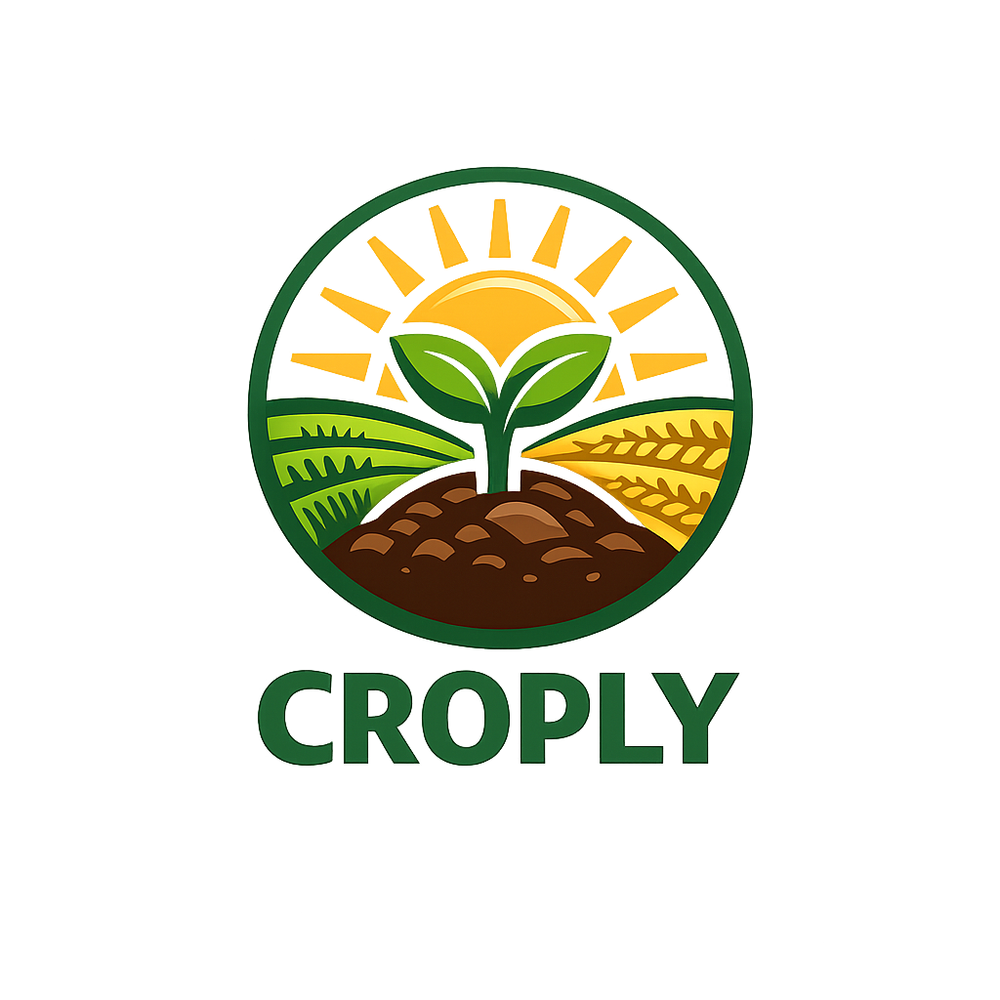
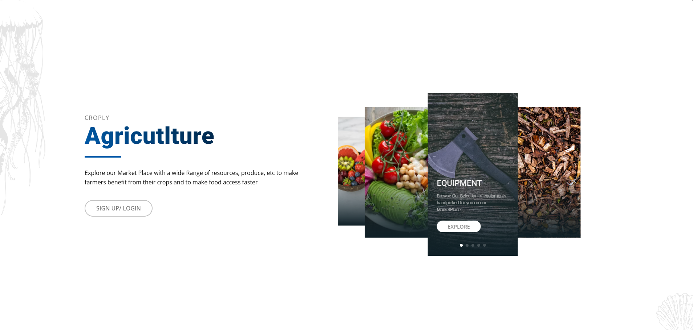
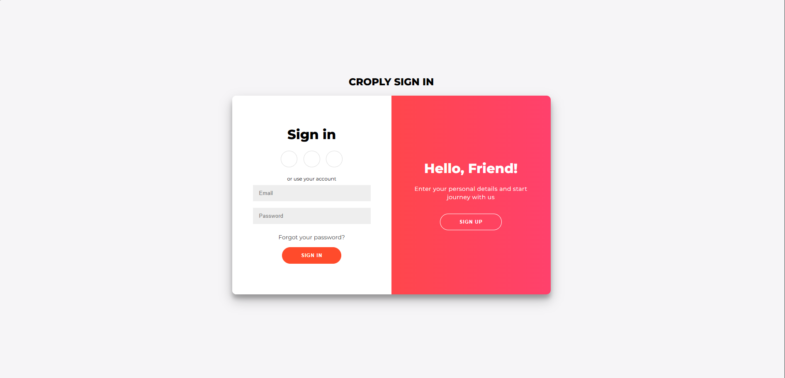
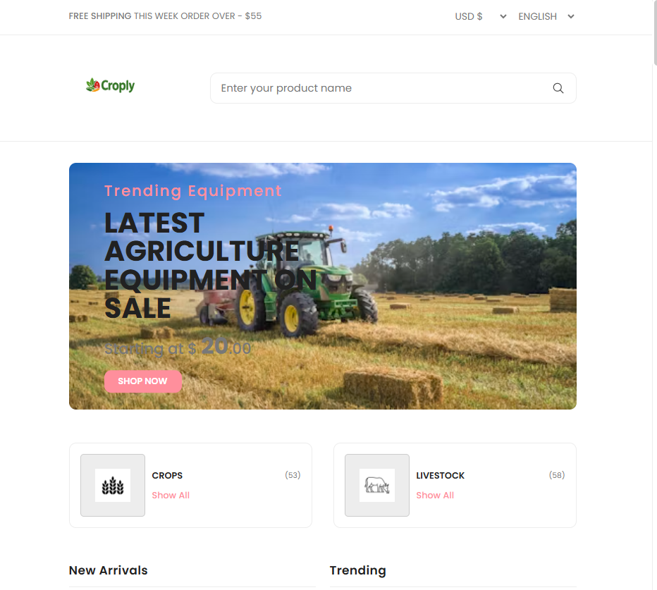

# Croply


Modern Agriculture E-commerce Platform


## Overview 
Croply is a web-based agriculture marketplace that connects farmers and buyers. Users can browse products, manage orders all to increase profit and reduce the amount of food lost in the delivery aspect. 

## Why I chose this
In countries like Ghana, Post harvest loss is a very common thing this is due to the main agriculture being done in other regions or what others would call states. Now the main or capital of the country is Accra and due to this People move all the way from other regions to the capital all to find a place to get jobs and etc. this brings up the need for more food to be supplied. The distance between the capital and the farming region is about 2- 3 days and the roads they take are usuallu untarred or are in poor conditions. this causes the produce and etc to get wasted. our systems Croply is more of a solution to that, using drone delivery or a delivery man people can order the things they need and get it delivered to their doorstep.

Reason 2:
I also wanted to try and work on a project without the use of ai and also work on my html and css because I am a lazy developer and just use templates but I somehow ended up using templates most of the time for the project. 
So thanks horizons for this oportunity because genuinely speaking I wouldnt even have time to do most of the work myself for no benefit and besides most of my software development is/ are for competitions here in Ghana. 

## Screenshots

### Home Page


### Login


### Market


## Features
- User Authentication
- Product MarketPlace
- User Shop set-up
- Mobile Friendly Design
- (Future additon) Music Player
- Delivery Tracking Time

## Technologies Used 
- Flask 
- Python 
- SQLAlchemy
- JavaScript
- Css
- Scss
- HTML

## Installation

1. Clone the repository

```bash
git clone https://github.com/NuelNexus/Croply.git
```
## Setup
Run 
```bash
pip install -r requirements.txt
```

Activate virtual env
Mine is called Hack cause of hack club and I got no idea for it at the moment 
You can create yours if you want

```bash 
python -m venv venv(put whatever name you want here)
```
Then Run

```bash 
python app.py
```
### Project Structure
```bash
croply/
├── static/
├── templates/
├── database/
├── app.py
└── requirements.txt
```
